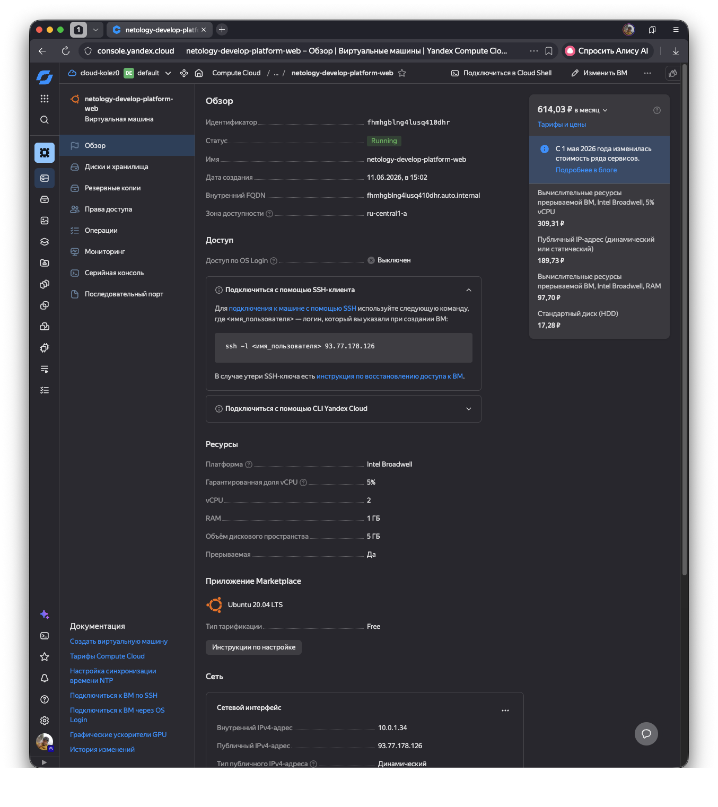
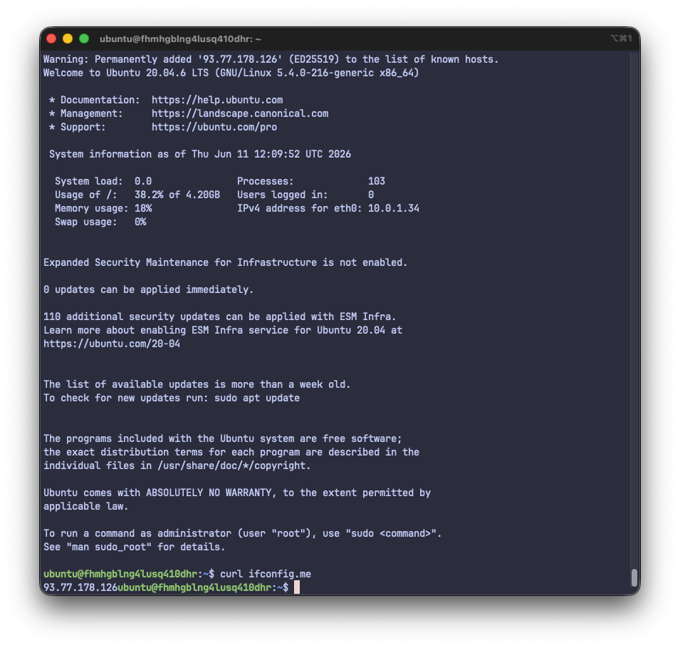
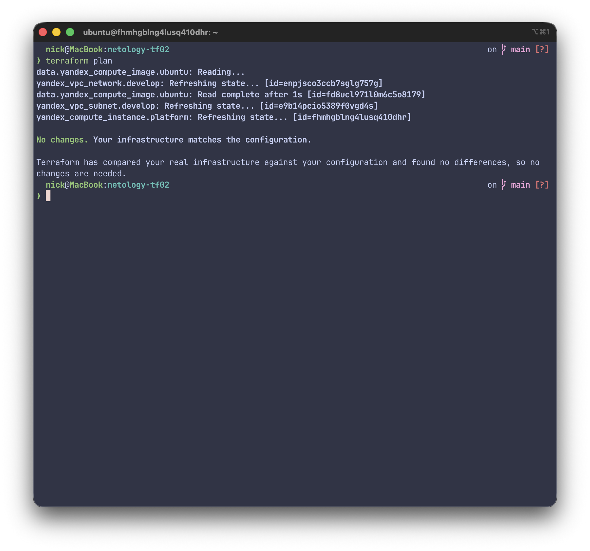
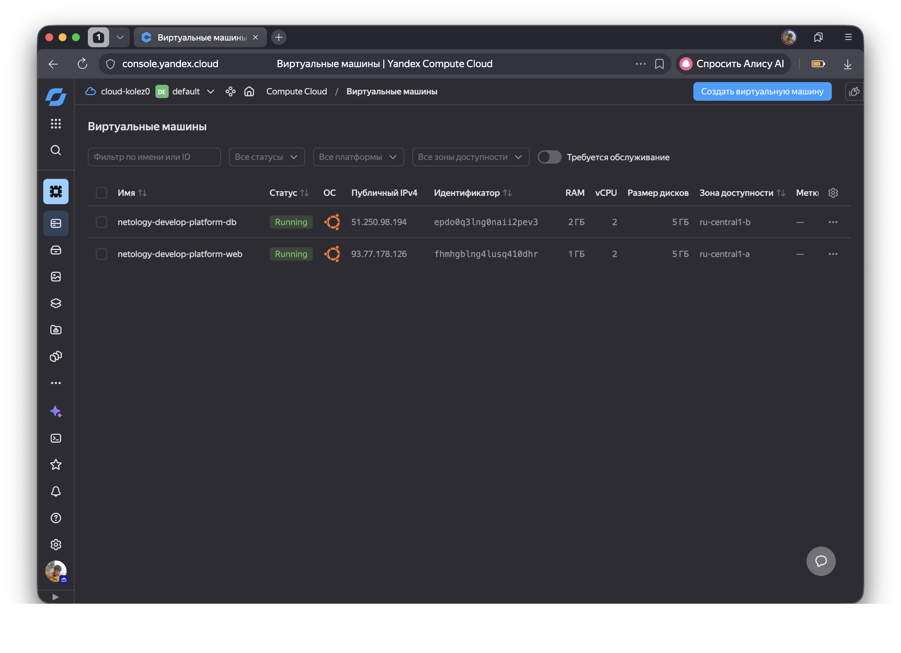
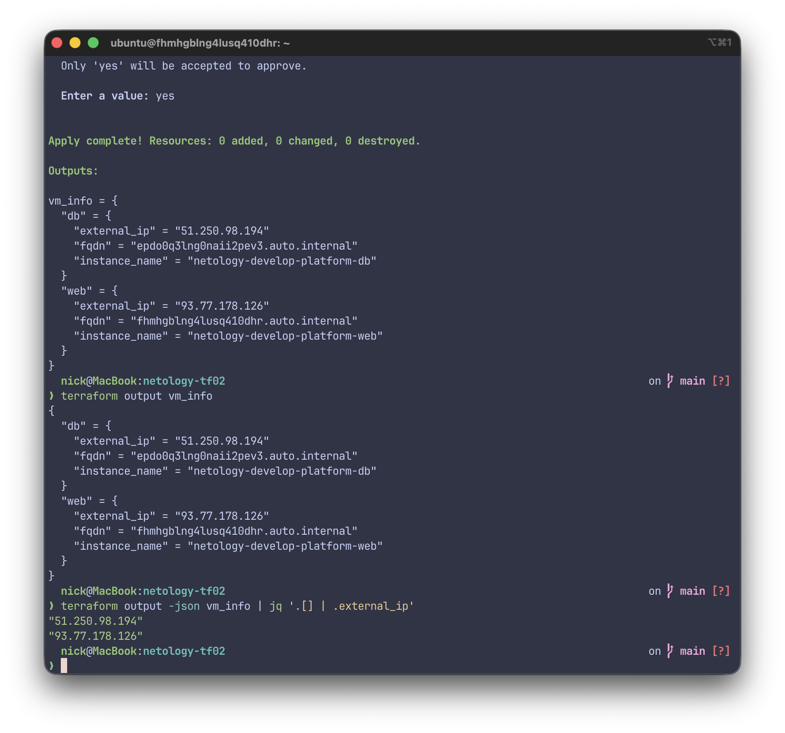
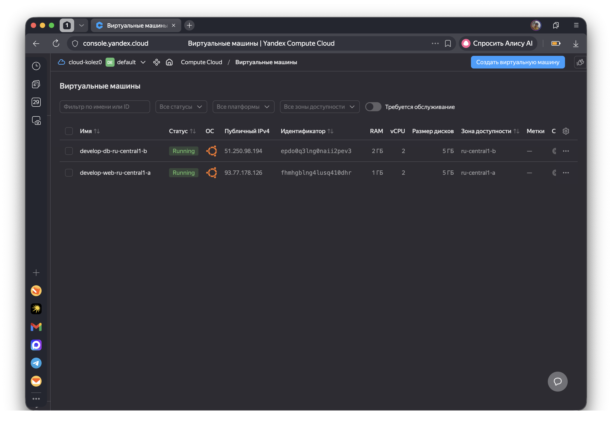
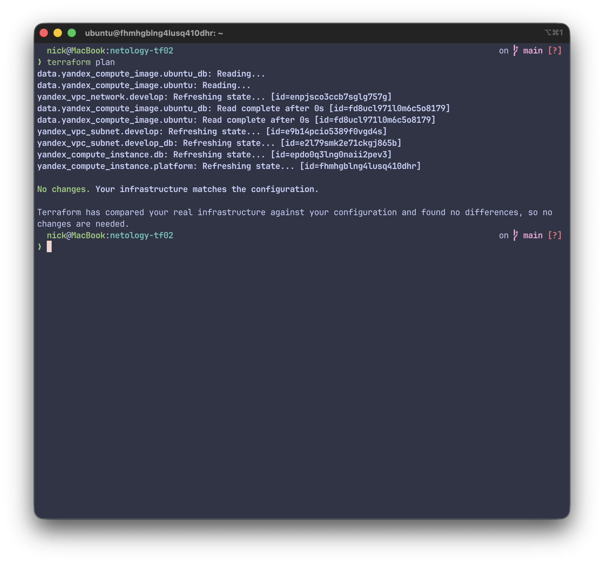
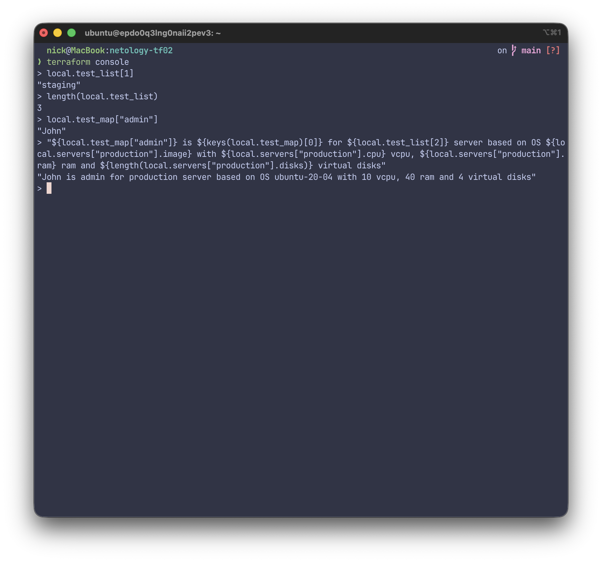

# Задание 1
В **main.tf** допущена синтаксическая ошибка и указан несуществующий тип платформы:
```hcl
platform_id = "standart-v4"
```
Исправляем синтаксическую ошибку и указываем платформу на базе Intel Xeon (Skylake/Cascade Lake) :
```hcl
platform_id = "standard-v1"
```
В файле **variables.tf** определена переменная 
```hcl
variable "vms_ssh_root_key" 
```
По условию задания необходимо использовать переменную 
```hcl
variable "vms_ssh_public_root_key" 
```
Соответственно в **main.tf** исправляем имя переменной в разделе
```hcl
  metadata = {
    serial-port-enable = 1
    ssh-keys           = "ubuntu:${var.vms_ssh_public_root_key}"
  }
```
В файле **variables.tf** не определены значения переменных **cloud_id** и **folder_id**. Чтобы не вводить вручную значения указываем их в ключе **default** каждой переменной.
```hcl
variable "cloud_id" {
  type        = string
  default     = "b1g0bcbge4leskva6q64"
  description = "https://cloud.yandex.ru/docs/resource-manager/operations/cloud/get-id"
}

variable "folder_id" {
  type        = string
  default = "b1gm8a6tiffresiiosuj"
  description = "https://cloud.yandex.ru/docs/resource-manager/operations/folder/get-id"
}
```
Yandex Cloud не позволяет создавать виртуальные машины с одним ядром. Исправляем на допустимые минимальные значения:
```hcl
 resources {
    cores         = 2
    memory        = 1
    core_fraction = 5
  }
```
Скриншоты созданной ВМ:


Параметр **preemptible = true** используется для создания прерываемой ВМ. Параметр **core_fraction = 5** указывает на выделение 5% времени для одного vCPU. Эти два параметра позволяют получить максимальную скидку на цену ВМ. В учебных целях ВМ с такими параметрами достаточно, и это позволяет экономить бюджет. 


# Задание 2
 Объявляем переменные **vm_web_*** в файле **variables.tf**
 ```hcl
 variable "vm_web_image_family" {
  type        = string
  default     = "ubuntu-2004-lts"
  description = "VM image family"
}

variable "vm_web_name" {
  type        = string
  default     = "netology-develop-platform-web"
  description = "VM  name"
}

variable "vm_web_platform_id" {
  type        = string
  default     = "standard-v1"
  description = "VM platform ID"
}

variable "vm_web_cores" {
  type        = number
  default     = 2
  description = "VM CPU cores"
}

variable "vm_web_memory" {
  type        = number
  default     = 1
  description = "VM memory"
}

variable "vm_web_core_fraction" {
  type        = number
  default     = 5
  description = "VM core_fraction"
}

variable "vm_web_preemptible" {
  type        = bool
  default     = true
  description = "VM preemptible flag"
}

variable "vm_web_nat" {
  type        = bool
  default     = true
  description = "VM enable NAT flag"
}

variable "vm_web_serial_port_enable" {
  type        = number
  default     = 1
  description = "VM enable serial port option"
}
```
 В файле **main.tf** меняем все хардкод-значения на переменные.
```hcl
data "yandex_compute_image" "ubuntu" {
  family = var.vm_web_image_family
}
resource "yandex_compute_instance" "platform" {
  name        = var.vm_web_name
  platform_id = var.vm_web_platform_id
  resources {
    cores         = var.vm_web_cores
    memory        = var.vm_web_memory
    core_fraction = var.vm_web_core_fraction
  }
  boot_disk {
    initialize_params {
      image_id = data.yandex_compute_image.ubuntu.image_id
    }
  }
  scheduling_policy {
    preemptible = var.vm_web_preemptible
  }
  network_interface {
    subnet_id = yandex_vpc_subnet.develop.id
    nat       = var.vm_web_nat
  }

  metadata = {
    serial-port-enable = var.vm_web_serial_port_enable
    ssh-keys           = "ubuntu:${var.vms_ssh_public_root_key}"
  }

}
```
 Проверяем **terraform plan**


# Задание 3
Переменные **vm_web_*** переносим в файл **vms_platform.tf**

В этом же файле создаем переменные **vm_db_*** с необходимыми значениями согласно заданию
```hcl
variable "vm_db_image_family" {
  type        = string
  default     = "ubuntu-2004-lts"
  description = "VM image family"
}

variable "vm_db_name" {
  type        = string
  default     = "netology-develop-platform-db"
  description = "VM  name"
}

variable "vm_db_platform_id" {
  type        = string
  default     = "standard-v1"
  description = "VM platform ID"
}

variable "vm_db_cores" {
  type        = number
  default     = 2
  description = "VM CPU cores"
}

variable "vm_db_memory" {
  type        = number
  default     = 2
  description = "VM memory"
}

variable "vm_db_core_fraction" {
  type        = number
  default     = 20
  description = "VM core_fraction"
}

variable "vm_db_preemptible" {
  type        = bool
  default     = true
  description = "VM preemptible flag"
}

variable "vm_db_nat" {
  type        = bool
  default     = true
  description = "VM enable NAT flag"
}

variable "vm_db_serial_port_enable" {
  type        = number
  default     = 1
  description = "VM enable serial port option"
}
```
По заданию новая ВМ должна быть размещена в зоне доступности **ru-central1-b**, следовательно добавляем переменные для описания зоны и подсети
```hcl
variable "vm_db_zone" {
  type        = string
  default     = "ru-central1-b"
  description = "DB VM availability zone"
}

variable "vm_db_subnet_cidr" {
  type        = list(string)
  default     = ["10.0.2.0/24"]
  description = "DB VM subnet"
}
```
Так же добавляем переменную для определения VPC
```hcl
variable "vpc_db_name" {
  type        = string
  default     = "netology-develop-platform-db"
  description = "DB VPC name"
}
```
В **main.tf** добавляем описания новых ресурсов
```hcl
resource "yandex_vpc_subnet" "develop_db" {
  name           = var.vpc_db_name
  zone           = var.vm_db_zone
  network_id     = yandex_vpc_network.develop.id
  v4_cidr_blocks = var.vm_db_subnet_cidr
}
```
```hcl
data "yandex_compute_image" "ubuntu_db" {
  family = var.vm_db_image_family
}
```
```hcl
resource "yandex_compute_instance" "db" {
  name        = var.vm_db_name
  platform_id = var.vm_db_platform_id
  zone        = var.vm_db_zone

  resources {
    cores         = var.vm_db_cores
    memory        = var.vm_db_memory
    core_fraction = var.vm_db_core_fraction
  }

  boot_disk {
    initialize_params {
      image_id = data.yandex_compute_image.ubuntu_db.image_id
    }
  }

  scheduling_policy {
    preemptible = var.vm_db_preemptible
  }

  network_interface {
    subnet_id = yandex_vpc_subnet.develop_db.id
    nat       = var.vm_db_nat
  }

  metadata = {
    serial-port-enable = var.vm_db_serial_port_enable
    ssh-keys           = "ubuntu:${var.vms_ssh_public_root_key}"
  }
}
```
После **terraform apply** получаем


# Задание 4


# Задание 5
Составляем имя ВМ из переменных с названием VPC, зоны и назначения ВМ 
```hcl
locals {
  vm_web_name = "${var.vpc_name}-web-${var.default_zone}"
  vm_db_name  = "${var.vpc_name}-db-${var.vm_db_zone}"
}
```
После **terraform apply** получаем


# Задание 6
Объявляем map-переменные в файле **vms_platform.tf**
```hcl
variable "vms_resources" {
  type = map(object({
    cores         = number
    memory        = number
    core_fraction = number
  }))
}

variable "metadata" {
  type        = map(string)
}
```
Затем в файле **terraform.tfvars** присваиваем значения
```hcl
vms_resources = {
  web = {
    cores         = 2
    memory        = 1
    core_fraction = 5
  },
  db = {
    cores         = 2
    memory        = 2
    core_fraction = 20
  }
}

metadata = {
  "serial-port-enable" = 1
  "ssh-keys"           = "ubuntu:ssh-ed25519 AAAAC3NzaC1lZDI1NTE5AAAAILjTVfnVcoVEDcrJ5JkiSMyUknmee5h4OdY0Sxq9FfWL YandexCloudKey"
}
```
В **main.tf** изменяем описание ресурсов с использованием переменных **vms_resources** и **metadata**. Комментируем более не используемые переменные.

После **terraform plan** убеждаемся что изменений в инфраструктуре нет.


# Задание 7


# Задание 8
Описываем переменную **test** в файле **vms_platform.tf**
```hcl
variable "test" {
  type = list(map(list(string)))
}
```
Добавляем в **terraform.tfvars** содержимое переменной **test**
```hcl
test = [
  {
    "dev1" = [
      "ssh -o 'StrictHostKeyChecking=no' ubuntu@62.84.124.117",
      "10.0.1.7",
    ]
  },
  {
    "dev2" = [
      "ssh -o 'StrictHostKeyChecking=no' ubuntu@84.252.140.88",
      "10.0.2.29",
    ]
  },
  {
    "prod1" = [
      "ssh -o 'StrictHostKeyChecking=no' ubuntu@51.250.2.101",
      "10.0.1.30",
    ]
  },
]
```
Выражение в **terraform console** для вывода нужной строки:
```hcl
var.test[0]["dev1"][0]
```
